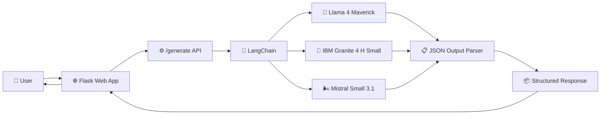
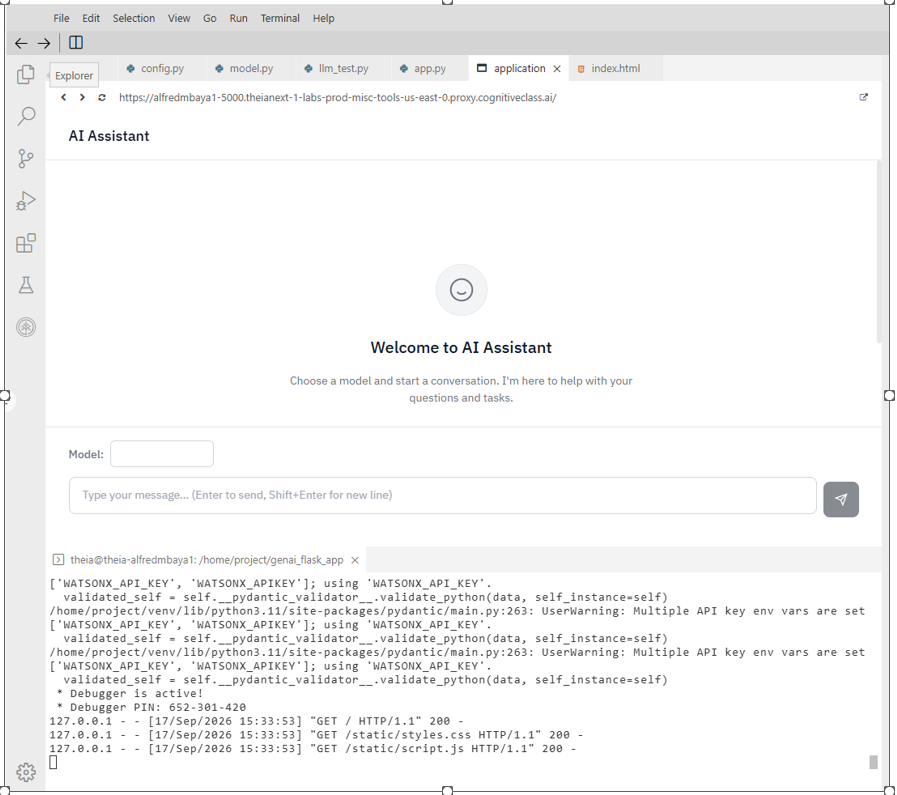
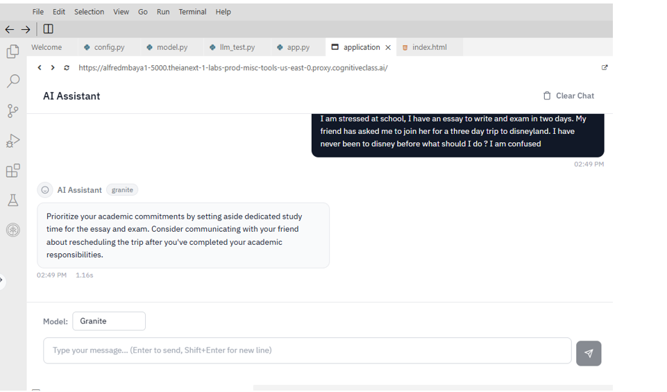
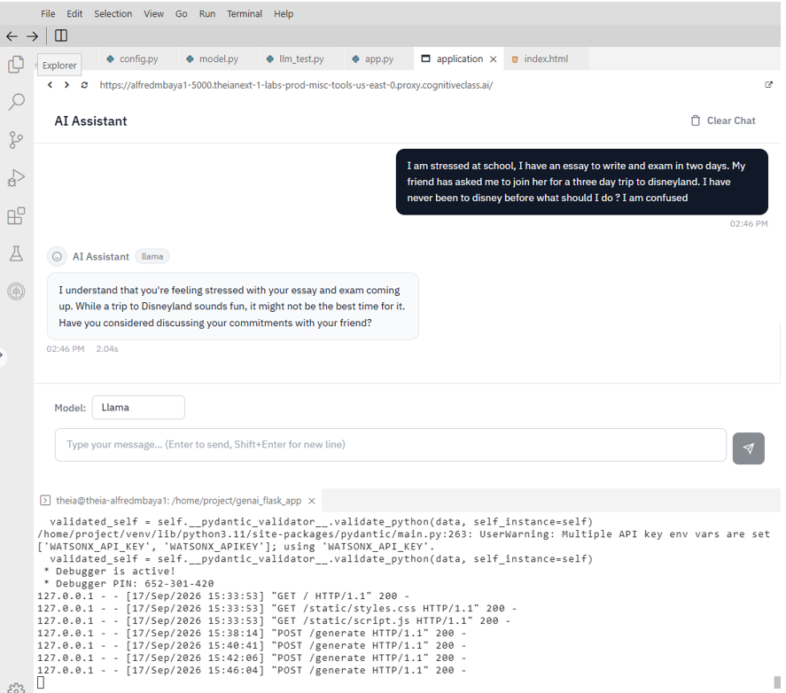
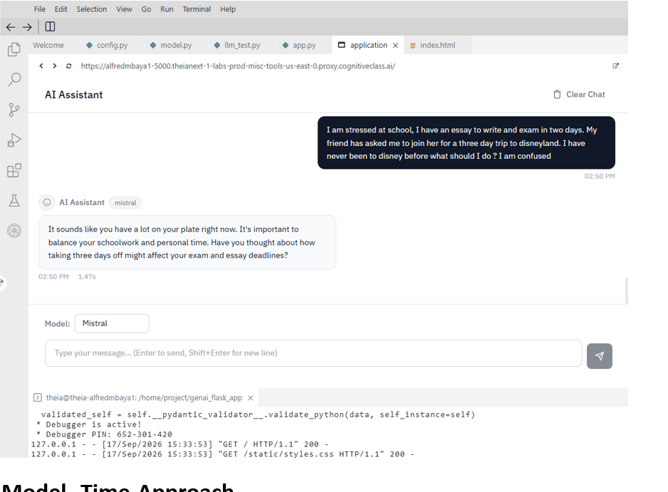

# 🤖 Multi-Model GenAI Application with LangChain
This project demonstrates how to build a multi-model Generative AI application using LangChain, Flask, and IBM watsonx.ai.
Users can submit the same prompt to different foundation models—including 
IBM Granite, Meta Llama, and Mistral—and compare response style and latency through a common application interface.
## 📑 Table of Contents

- [🎯 Project Overview](#-project-overview)
- [🏗️ Architecture](#️-architecture)
- [✨ Features](#-features)
- [🧠 Models Compared](#-models-compared)
- [⚙️ Tech Stack](#️-tech-stack)
- [🔗 LangChain Workflow](#-langchain-workflow)
- [📊 Model Comparison](#-model-comparison)
- [📸 Application Screenshots](#-application-screenshots)
- [📂 Project Structure](#-project-structure)
- [🚀 Running the Application](#-running-the-application)
- [💡 Key Learnings](#-key-learnings)
 ##  Project Overview

This project explores how different Large Language Models (LLMs) respond to the same user prompts when integrated through a common application framework.

The application was built using **Python, LangChain, Flask, and IBM watsonx.ai** and provides a simple web interface where users can select and interact with multiple foundation models.

### Models evaluated
- **Meta Llama 4 Maverick**
- **IBM Granite 4 H Small**
- **Mistral Small 3.1**

The project demonstrates how LangChain can provide a reusable abstraction layer for working with different LLMs while supporting model-specific prompt templates and structured JSON responses.

The application also records response latency, allowing model outputs and response times to be compared during testing.

## 🏗️ Architecture

The application uses Flask as the web layer and LangChain as the orchestration layer between the user interface and multiple foundation models hosted through IBM watsonx.ai.



### Application Flow

**User Prompt → Flask → LangChain → Selected LLM → JSON Parser → Structured Response → Web Interface**
## ✨ Features

- 🤖 **Multi-Model AI Support** — Select between Meta Llama, IBM Granite, and Mistral from a single application.
- 🔗 **LangChain Integration** — Uses a reusable LangChain workflow to connect prompt templates, LLMs, and output parsing.
- 🧩 **Model-Specific Prompt Templates** — Formats prompts according to the requirements of each foundation model.
- 📦 **Structured JSON Output** — Uses Pydantic and LangChain's `JsonOutputParser` to generate consistent, application-ready responses.
- 💬 **Interactive Web Interface** — Flask, HTML, CSS, and JavaScript provide a simple interface for submitting prompts and viewing responses.
- ⏱️ **Response-Time Tracking** — Measures model response latency for side-by-side testing.
- 🛠️ **Modular Design** — Separates application routing, model configuration, model integration, templates, and static assets for easier maintenance.
## 🧠 Models Compared

The application integrates three foundation models through IBM watsonx.ai. Each model receives the same user prompt, allowing differences in response style and latency to be observed through a consistent LangChain workflow.

| Model | Provider | Model Used |
|---|---|---|
| 🦙 **Llama** | Meta | Llama 4 Maverick |
| 🧠 **Granite** | IBM | Granite 4 H Small |
| 🌬️ **Mistral** | Mistral AI | Mistral Small 3.1 |

Using multiple models behind the same application demonstrates one of the key benefits of LangChain: the application workflow can remain largely consistent while the underlying LLM is changed.
## ⚙️ Tech Stack

| Technology | Role in the Project |
|---|---|
| 🐍 **Python** | Core application and AI integration logic |
| 🔗 **LangChain** | LLM orchestration, prompt templates, chaining, and output parsing |
| 🧠 **IBM watsonx.ai** | Provides access to the foundation models used by the application |
| 🌐 **Flask** | Backend web framework and `/generate` API endpoint |
| 📋 **Pydantic** | Defines the structured AI response schema |
| 📦 **JsonOutputParser** | Converts LLM output into structured JSON |
| 🖥️ **HTML / CSS** | Application interface and styling |
| ⚡ **JavaScript** | Sends user requests to Flask and displays model responses |
### Core AI Libraries

- `langchain`
- `langchain-ibm`
- `ibm-watsonx-ai`
- `pydantic`
- `flask`
## 🔗 LangChain Workflow

LangChain provides the orchestration layer that connects the prompt template, selected language model, and structured output parser.

The core workflow is built using **LangChain Expression Language (LCEL)**:

```python
chain = template | model | json_parser
```

Each component has a specific responsibility:

1. **PromptTemplate** — Formats the system instructions and user prompt according to the selected model.
2. **Model** — Sends the formatted prompt to the selected foundation model through IBM watsonx.ai.
3. **JsonOutputParser** — Parses the model output into a consistent structured response.

The chain is then invoked with:

```python
return chain.invoke({
    "system_prompt": system_prompt,
    "user_prompt": user_prompt,
    "format_prompt": json_parser.get_format_instructions()
})
```

### Structured Response

Pydantic defines the expected AI response structure:

```python
class AIResponse(BaseModel):
    summary: str
    sentiment: int
    response: str
    next_step: str
```

This produces a predictable application response containing:

- 📝 **Summary** — Summary of the user's message
- 📊 **Sentiment** — Sentiment score from 0 to 100
- 💬 **Response** — Suggested response to the user
- ➡️ **Next Step** — Recommended action for the support representative

This modular design allows the same LangChain workflow to be reused while changing the underlying LLM and its model-specific prompt template.
## 📊 Model Comparison

To observe differences between the models, the same scenario was submitted to Llama, Granite, and Mistral.

### Test Scenario

> A student is stressed about an upcoming essay and exam while also deciding whether to join a friend on a three-day trip to Disneyland.

### Observed Results

| Model | Response Time | Observed Response Style |
|---|---:|---|
| 🧠 **IBM Granite** | **1.16s** | Direct and action-oriented; prioritized academic commitments and suggested rescheduling the trip |
| 🌬️ **Mistral** | **1.47s** | Reflective and exploratory; encouraged considering how the trip could affect academic responsibilities |
| 🦙 **Llama** | **2.04s** | Empathetic and conversational; acknowledged the student's stress and suggested discussing the situation with their friend |

### Key Observation

Although all three models received the same scenario, their responses differed in tone and approach.

- **Granite** provided the most direct recommendation.
- **Mistral** encouraged the user to evaluate the consequences.
- **Llama** placed greater emphasis on empathy and the user's situation.

Response latency also varied between requests. For example, Llama responded in **2.04 seconds** during this test but took **10.92 seconds** during an earlier test.

> **Note:** These response times represent individual application test runs and should not be interpreted as formal performance benchmarks. Model latency can vary between requests and environments.


## 📸 Application Screenshots

The application provides a simple web interface where users can enter a prompt, select a foundation model, and compare the generated response and response time.

### 🖥️ Application Interface



### 🧠 IBM Granite



### 🦙 Meta Llama



### 🌬️ Mistral




